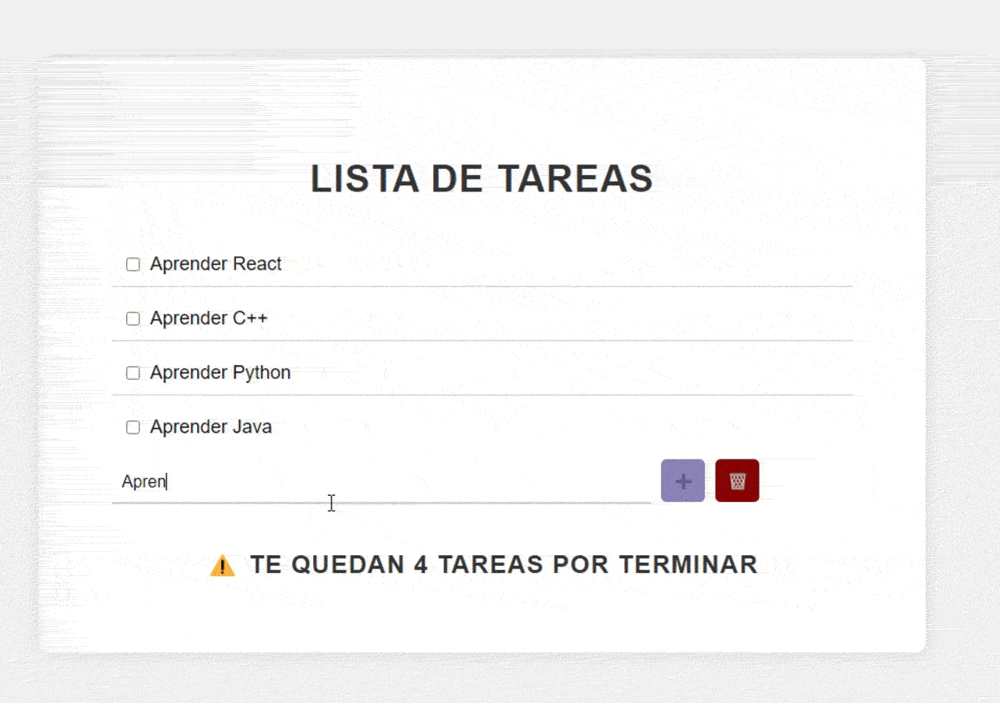

<h1 align="center">ToDo App</h1>

 
 

  

 
 

## 📖 About
This is a simple ToDo app built with React. It allows you to add and delete tasks and mark them as complete.

This project was based on the tutorial [APRENDE REACT BÁSICO en 30 MINUTOS ⏰](https://www.youtube.com/watch?v=EMk6nom1aS4) by 
Carlos Azaustre.

## 🚀 Getting Started
To get a local copy up and running follow these simple steps:

1. Clone the repository: 
git clone git@github.com:stephaniearismendi/react-to-do-list.git

2. Install the dependencies:
cd react-to-do-list
npm install

3. Run the app:
npm start

4. Open [http://localhost:3000](http://localhost:3000) to view it in the browser.

## 🎨 Design
The app has been styled using CSS and includes some customizations to give it a more modern look. Some of the design features include:
- Rounded corners on buttons and input fields
- Use of Google Fonts for typography
- Custom colors for buttons and icons

## 👨‍💻 Contributing
Contributions are always welcome! If you'd like to contribute to this project, feel free to fork the repository and submit a pull request.

## 🌐 Deployed Website
This app is deployed using GitHub Pages and can be accessed at https://stephaniearismendi.github.io/react-to-do-list/.
